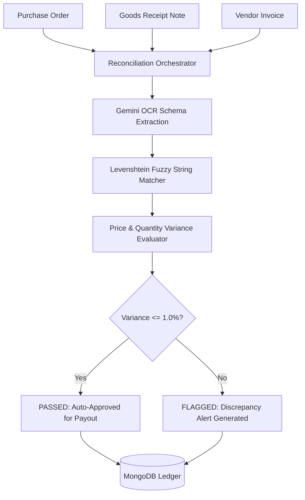

# Three-Way Match Engine — Transactional Reconciliation System

[](https://nodejs.org/)
[](https://expressjs.com/)
[](https://www.mongodb.com/)
[](https://deepmind.google/technologies/gemini/)

An enterprise financial reconciliation engine designed to automate three-way matching across **Purchase Orders (PO)**, **Goods Receipt Notes (GRN)**, and **Invoices**. Uses fuzzy string comparison algorithms and Google Gemini API OCR parsing to reconcile line items and detect payout variances.

---

## 📌 Executive Overview

In procurement operations, manual verification of vendor invoices against purchase orders and receiving logs is error-prone and slow. **Three-Way Match Engine** automates line-item reconciliation, tolerating vendor nomenclature variations via Levenshtein distance calculations and flagging price/quantity variances exceeding configurable thresholds.

---

## 🏗️ Reconciliation Pipeline



---

## ✨ Key Features

* **Asynchronous Upload Queue**: Handles out-of-order document uploads without failing state sequences.
* **Fuzzy Item Normalization**: Matches vendor item descriptions (e.g. "Widget A-100" vs "Widget A100") using Levenshtein distance scoring.
* **Configurable Variance Thresholds**: Automatically flags line items exceeding allowable price/quantity variances (default: 1.0%).

---

## 🚀 Getting Started

```bash
git clone https://github.com/KrishnaKanhaiya1/Three-Way-MatchEngine.git
cd Three-Way-MatchEngine

npm install
cp .env.example .env
npm start
```
