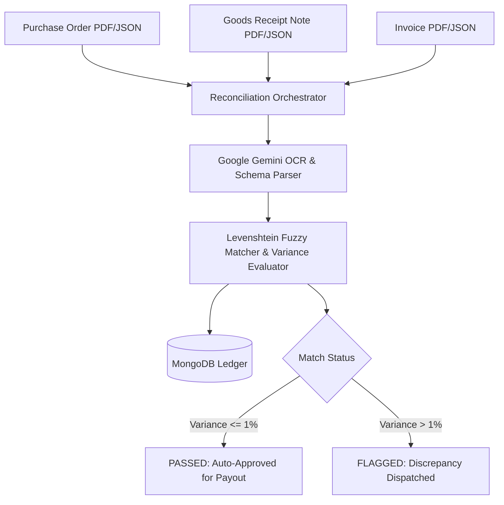

# ⚖️ Three-Way Match Engine — Procurement Reconciliation System

[](https://nodejs.org/)
[](https://expressjs.com/)
[](https://www.mongodb.com/)
[](https://deepmind.google/technologies/gemini/)

> **An enterprise-grade financial reconciliation engine designed to automate three-way matching across Purchase Orders (PO), Goods Receipt Notes (GRN), and Invoices.** Features Levenshtein-distance fuzzy item matching, configurable price/quantity variance tolerances, and Google Gemini API intelligent OCR extraction.

---

## 💡 Reconciliation Pipeline Architecture



---

## ✨ UI Features & Functionality Inventory

| UI Feature Module | Interactive Functionality | Real User Flow |
| :--- | :--- | :--- |
| **Document Upload Dashboard** | Upload Purchase Orders, Goods Receipt Notes, and Invoices simultaneously or asynchronously. | Drag PO & Invoice files $\rightarrow$ Click "Run Reconciliation" $\rightarrow$ Real-time processing progress bar. |
| **Fuzzy Match Inspector** | Displays string similarity percentages for line item descriptions across vendor documents. | Inspect line item match list $\rightarrow$ View Levenshtein score (e.g. "Widget A-100" vs "Widget A100": 98% match). |
| **Discrepancy & Variance Alerts** | Highlights line items exceeding price or quantity tolerance thresholds (default: 1.0%). | Filter by "FLAGGED" status $\rightarrow$ View exact price discrepancy $\rightarrow$ Approve or Reject payout. |

---

## 🛠️ Local Developer Setup

```bash
git clone https://github.com/KrishnaKanhaiya1/Three-Way-MatchEngine.git
cd Three-Way-MatchEngine
npm install
cp .env.example .env
npm start
```
