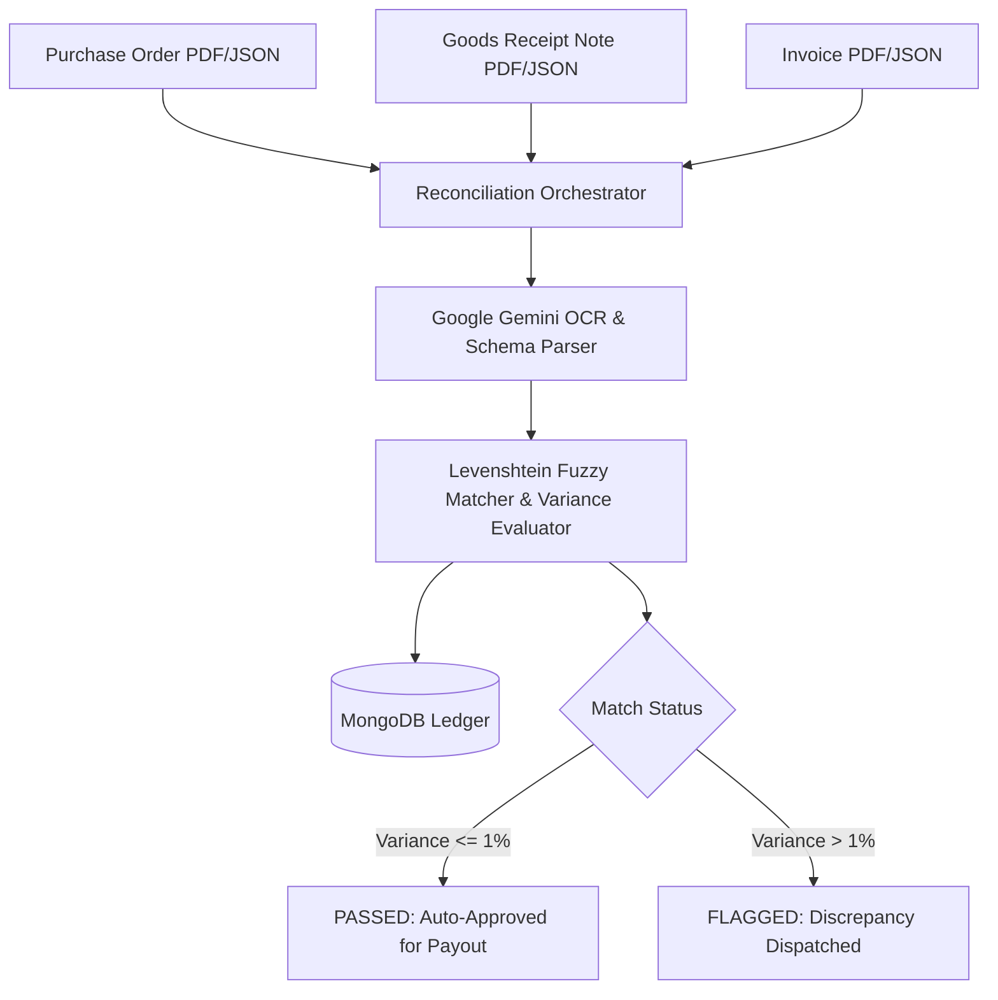

# ⚖️ Three-Way Match Engine — Transactional Reconciliation System

[](https://nodejs.org/)
[](https://expressjs.com/)
[](https://www.mongodb.com/)
[](https://deepmind.google/technologies/gemini/)

> **An enterprise-grade financial reconciliation engine designed to automate three-way matching across Purchase Orders (PO), Goods Receipt Notes (GRN), and Invoices.** Features Levenshtein-distance fuzzy item matching ($\mathcal{O}(M \times N)$ complexity), configurable price/quantity variance tolerances, and Google Gemini API intelligent OCR extraction.

---

## 💡 Reconciliation Pipeline



---

## 🧮 Levenshtein Distance Matrix Formula

$$D(i, j) = \begin{cases} \max(i, j) & \text{if } \min(i, j) = 0, \\ \min \begin{cases} D(i-1, j) + 1 \\ D(i, j-1) + 1 \\ D(i-1, j-1) + 1_{(a_i \neq b_j)} \end{cases} & \text{otherwise.} \end{cases}$$

---

## 🛠️ Local Developer Setup

```bash
git clone https://github.com/KrishnaKanhaiya1/Three-Way-MatchEngine.git
cd Three-Way-MatchEngine
npm install
cp .env.example .env
npm start
```
