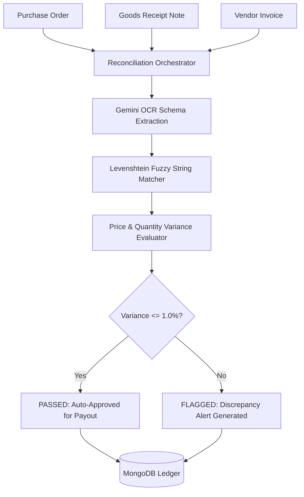

# ⚖️ Three-Way Match Engine — Procurement Reconciliation System

[](https://nodejs.org/)
[](https://expressjs.com/)
[](https://www.mongodb.com/)
[](https://deepmind.google/technologies/gemini/)

An enterprise financial reconciliation engine designed to automate three-way matching across **Purchase Orders (PO)**, **Goods Receipt Notes (GRN)**, and **Invoices**. Uses fuzzy string comparison algorithms and Google Gemini OCR parsing to reconcile line items and detect payout variances.

---

## 📌 Executive Summary

In procurement operations, manual verification of vendor invoices against purchase orders and receiving logs is slow and error-prone. **Three-Way Match Engine** automates line-item reconciliation, handling vendor nomenclature variations via Levenshtein distance calculations and flagging price/quantity variances exceeding configurable thresholds.

---

## 🏗️ Reconciliation Pipeline



---

## ✨ Key Features

* **Asynchronous Document Processing**: Handles out-of-order document uploads without failing state sequences.
* **Fuzzy Line-Item Normalization**: Matches vendor item descriptions (e.g. "Widget A-100" vs "Widget A100") using Levenshtein distance scoring.
* **Configurable Variance Thresholds**: Automatically flags line items exceeding allowable price/quantity variances (default: 1.0%).
* **Audit Trail Ledger**: Persists match statuses (`PASSED`, `FLAGGED`, `PENDING`) to MongoDB.

---

## 💻 Tech Stack

* **Backend**: Node.js, Express.js
* **Database**: MongoDB (Mongoose ORM)
* **OCR & AI Service**: Google Gemini Vision API
* **Algorithms**: Levenshtein Distance Matching

---

## 🚀 Getting Started

### Prerequisites
* **Node.js**: `v18.x` or higher
* **MongoDB**: Local instance or MongoDB Atlas cluster

### Environment Configuration
Create a `.env` file:

```env
PORT=5000
MONGODB_URI=mongodb://localhost:27017/three_way_match
GEMINI_API_KEY=your_google_gemini_api_key
VARIANCE_THRESHOLD_PERCENT=1.0
```

### Installation & Run Commands
```bash
# Clone repository
git clone https://github.com/KrishnaKanhaiya1/Three-Way-MatchEngine.git
cd Three-Way-MatchEngine

# Install dependencies
npm install

# Start server
npm start
```

---

## 📄 License

Distributed under the MIT License. See [LICENSE](LICENSE) for details.
