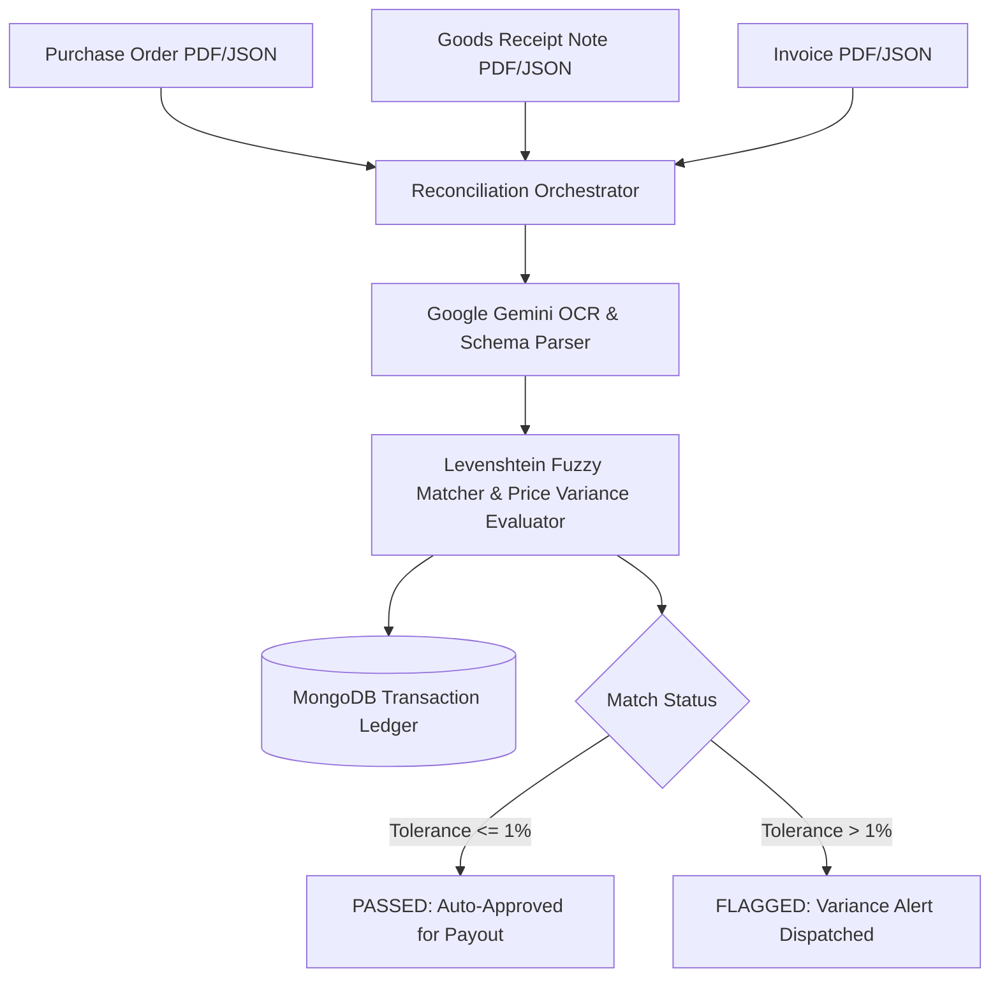

# Three-Way Match Engine

[](https://github.com/KrishnaKanhaiya1/Three-Way-MatchEngine/actions/workflows/ci.yml)
[](https://nodejs.org/)
[](https://expressjs.com/)
[](https://www.mongodb.com/)
[](https://deepmind.google/technologies/gemini/)
[](LICENSE)

An enterprise-grade, high-throughput financial reconciliation engine designed to automate the three-way matching lifecycle across **Purchase Orders (PO)**, **Goods Receipt Notes (GRN)**, and **Invoices**. Built with asynchronous document parsing pipelines, Levenshtein-distance fuzzy item matching, and Google Gemini API intelligent OCR extraction.

---

## ⚡ Architecture Flow



---

## 🚀 Key Technical Features

* **Asynchronous Out-of-Order Uploads**: State-driven matching queue tolerates PO, GRN, and Invoice uploads arriving out of sequence.
* **Fuzzy Item Normalization**: Implements Levenshtein string distance algorithm to reconcile item descriptions across legacy vendor systems.
* **Tolerance & Variance Engine**: Configurable line-item price and quantity variance thresholds (default: 1.0%).
* **OpenAPI / Swagger Specification**: Full interactive API routing specification included in `openapi.yaml`.

---

## 🛠️ Quick Start (Docker)

```bash
# Clone the repository
git clone https://github.com/KrishnaKanhaiya1/Three-Way-MatchEngine.git
cd Three-Way-MatchEngine

# Copy environment template
cp .env.example .env

# Run with Docker Compose
docker-compose up --build
```
